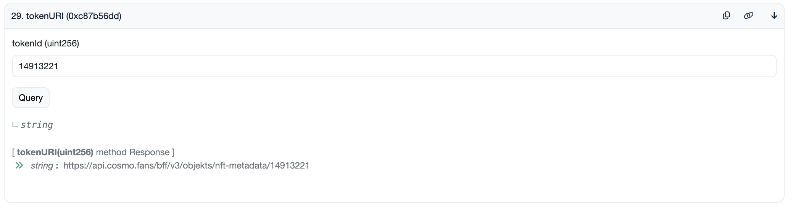
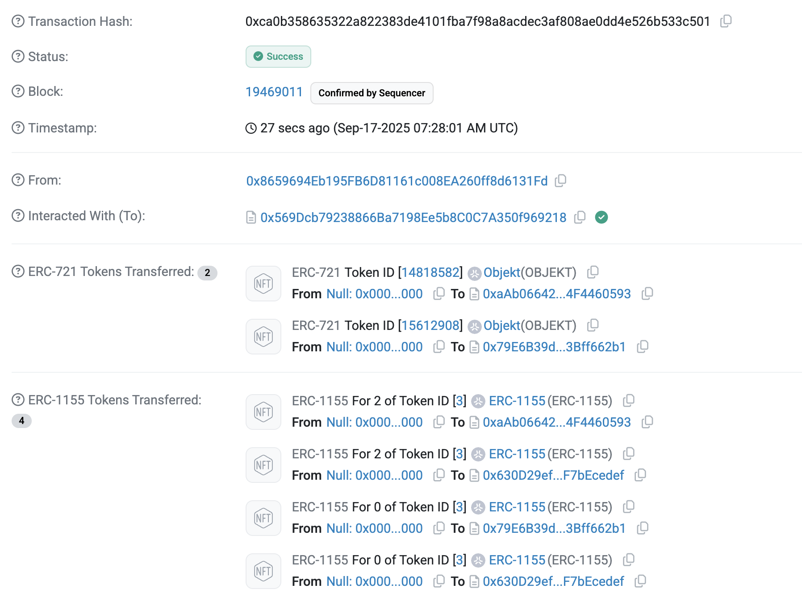
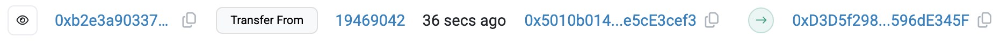

## Introduction

최근에 모드하우스의 cosmo라는 프로젝트를 발견하고 꽤 재밌는 시도라고 생각이 들어서 컨트랙트 코드를 읽어 보고 있습니다. cosmo 관련 컨트랙트에 대해 상세히 설명해놓은 자료를 찾기가 어려워서 제가 정리한 것들을 공유하려고 합니다.

## Objekt

Objekt는 NFT 형태의 디지털 포토카드입니다. Objekt를 구매하면 COMO 토큰을 얻을 수 있고, COMO 토큰으로 그룹의 의사 결정을 위한 투표인 Gravity에서 투표권을 행사할 수 있습니다.

2025년 9월 기준 컨트랙트는 Abstract 체인에 배포되어 있으며 이전에는 Polygon 체인을 이용 했던 걸로 보입니다. Objekt 컨트랙트 주소는 아래와 같습니다. (2025.09.15 기준)

> Proxy Contract: [0x99bb83ae9bb0c0a6be865cacf67760947f91cb70](https://abscan.org/address/0x99bb83ae9bb0c0a6be865cacf67760947f91cb70)

> Logic Contract: [0xae9940ab7118d4f0dee742a9198472e6ee2807c2](https://abscan.org/address/0xae9940ab7118d4f0dee742a9198472e6ee2807c2)

컨트랙트 코드는 Abstract 체인의 block explorer인 abscan에 등록되어 있는 코드입니다. tripleS, ARTMS, idntt 모두 한 Objekt 컨트랙트를 사용합니다.


Objekt 컨트랙트 코드는 OpenZeppelin ERC721 구현에서 크게 달라지지는 않아서 추가된 로직 위주로 설명하겠습니다. 

```solidity
contract ObjektV1 is
    UUPSUpgradeable,
    AccessControlUpgradeable,
    ERC721EnumerableUpgradeable,
    IObjekt
```

Objekt 컨트랙트는 업그레이드할 수 있는 컨트랙트로, 현재 사용 중인 로직 코드가 있는 logic contract와 logic contract의 주소로 delegate call을 하는 Proxy Contract가 존재합니다. 이번 글에서는 Proxy 관련 로직은 제외 하겠습니다.

`ObjectV1` 컨트랙트가 `ERC721EnumerableUpgradeable` 컨트랙트를 상속하고 있습니다. ERC721은 이더리움의 NFT 표준이고 이 컨트랙트에서는 OpenZeppelin이 구현한 [ERC721](https://github.com/OpenZeppelin/openzeppelin-contracts-upgradeable/blob/master/contracts/token/ERC721/extensions/ERC721EnumerableUpgradeable.sol)  컨트랙트를 상속받아서 기본적인 NFT 로직을 구현했습니다. 


### Global Variables

```solidity
bytes32 public constant MINTER_ROLE = keccak256("MINTER_ROLE");
/** @dev OPERATOR_ROLE can manage objekts */
bytes32 public constant OPERATOR_ROLE = keccak256("OPERATOR_ROLE");
```

Objekt 컨트랙트에는 `MINTER_ROLE` 과 `OPERATOR_ROLE` 그리고 기본 관리자 Role이 존재합니다. 변수명 그대로 `MINTER_ROLE` 을 가진 주소는 Objekt 발행 관련된 권한을 갖고 `OPERATOR_ROLE` 은 관리와 관련된 권한을 갖습니다.

```solidity
// ...

string public constant ERROR_NOT_MINTER = "ObjektV1: not minter";
string public constant ERROR_NOT_ADMIN = "ObjektV1: not admin";
string public constant ERROR_INVALID_TOKEN_ID_RANGE =
    "ObjektV1: invalid token ID range";
string public constant ERROR_ONLY_OWNER = "ObjektV1: only owner";

string private baseURI;

// transferability of each objekt
mapping(uint256 => bool) public isObjektTransferable;
// whitelist for token approval
mapping(address => bool) public approvalWhitelists;
// blacklist for token transfers, blacklisted account cannot call transferFrom()
mapping(address => bool) public blacklists;
```

Objekt는 `baseURI` + `tokenId` 방법으로 포토카드 이미지를 포함한 Objekt 메타데이터를 외부 서버에 저장하고 있습니다. 현재는 `https://api.cosmo.fans/bff/v3/objekts/nft-metadata/{tokenId}` 꼴의 URL에 각 Objekt의 메타데이터가 포함되어 있습니다.



메타데이터는 json 형식이며 key이름만 봐도 어떤 의미인지는 쉽게 알 수 있습니다. `image` 필드에 기록된 URL에는 해당 Objekt에 해당하는 포토카드 이미지 파일이 존재합니다.

```json
// https://api.cosmo.fans/bff/v3/objekts/nft-metadata/14913221
{
  "name": "Cream01 Choerry 120Z #14913221",
  "description": "ARTMS\n——————————————————\nObjekt is a NFT photo card of ARTMS.\nUsers can acquire (as a reward or buy), collect, and trade their Objekt in COSMO, our exclusive app.\nYou can also mint your physical Objekt by scanning its QR code by COSMO.",
  "image": "https://imagedelivery.net/qQuMkbHJ-0s6rwu8vup_5w/d85f05c5-28cb-44af-8f8f-2337f85a7c00/original",
  "background_color": "#FF7477",
  "attributes": [
    {
      "trait_type": "Artist",
      "value": "ARTMS"
    },
    {
      "trait_type": "Class",
      "value": "First"
    },
    {
      "trait_type": "Member",
      "value": "Choerry"
    },
    {
      "trait_type": "Season",
      "value": "Cream01"
    },
    {
      "trait_type": "Collection",
      "value": "120Z"
    }
  ]
}
```

마지막으로 `isObjektTransferable` 변수는 어떤 Objekt의 전송가능 여부를 저장합니다. `approvalWhitelist` , `blackList` mapping 변수의 용도는 아래에서 설명하겠습니다.

### Role

Objekt 컨트랙트에서는 `AccessControlUpgradeable` 컨트랙트를 이용해서 role마다 권한을 관리합니다. role은 위의 전역 변수에서 확인할 수 있듯이 `MINTER_ROLE` 과 `OPERATOR_ROLE` 이 있으며, 초기에 설정되는 `AccessControlUpgradeable.DEFAULT_ADMIN_ROLE` 기본 어드민 role도 있습니다.

Objekt에서는 role을 이용하여 특정 함수를 실행시킬 수 있는지 여부를 결정합니다.

### Objekt 발행 / 소각

#### mint

```solidity
function mint(address to, uint256 tokenId, bool transferable) public {
    require(hasRole(MINTER_ROLE, msg.sender), ERROR_NOT_MINTER);
    _mint(to, tokenId);
    isObjektTransferable[tokenId] = transferable;
}
```

`mint` 함수에서는 호출자가 `MINTER_ROLE` 을 갖고 있는지 확인한 후 인자로 받은 `tokenId` Objekt를 `to` 주소에게 발행합니다. 해당 Objekt의 전송 가능 여부는 `transferable` 변수로 설정합니다.

#### mintBatch

```solidity
function mintBatch(
    address to,
    uint256 startTokenId,
    uint256 endTokenId,
    bool transferable
) public {
    require(hasRole(MINTER_ROLE, msg.sender), ERROR_NOT_MINTER);
    require(endTokenId > startTokenId, ERROR_INVALID_TOKEN_ID_RANGE);

    for (uint256 tokenId = startTokenId; tokenId < endTokenId; tokenId++) {
        _mint(to, tokenId);
        isObjektTransferable[tokenId] = transferable;
    }
}
```

`tokenId`의 범위  `startTokenId` 부터 `endTokenId - 1` 까지 batch로 오브젝트를 발행합니다. 즉, `endTokenId - startTokenId`개의 오브젝트를 발행합니다. 전송 가능 여부는 모두 `transferable` 과 같습니다.

#### burn

```solidity
function burn(uint256 tokenId) public
```

자신이 소유한 Objekt를 소각합니다.

### Objekt 발행 주체



Objekt 발행은 `MINTER_ROLE` 권한을 가진 주소만 할 수 있습니다. Objekt transfer 기록을 보면 Objekt 컨트랙트에 직접 `transferFrom` 함수를 호출하는 것이 아니라 다른 컨트랙트(`0x569Dc...`; ObjektMinter)를 겨쳐서 Objekt 발행 관련 함수를 호출하는 것을 알 수 있습니다.
cosmo에서 운영하는 서버 혹은 봇이 `ObjektMinter` 컨트랙트의 함수를 호출하고 그 함수에서 Objekt를 발행하거나 COMO를 지급 하는 등의 행위를 하는 것으로 보입니다. 다음 글에서는 `ObjektMinter` 코드 설명도 같이 작성할 계획입니다. 

### Objekt 전송

#### approve, setApprovalForAll

Objekt 컨트랙트에서는 관리자가 `approvalWhitelists`에 등록한 주소에게만 권한을 부여할 수 있습니다.

#### transferFrom

```solidity
function transferFrom(
    address from,
    address to,
    uint256 tokenId
) public override(ERC721Upgradeable, IERC721) {
    require(!blacklists[msg.sender], ERROR_BLACKLISTED_MSG_SENDER);
    require(balanceOf(to) > 0, ERROR_CANNOT_TRANSFER_EXTERNALLY);
    require(isObjektTransferable[tokenId], ERROR_NON_TRANSFERABLE_OBJEKT);
    super.transferFrom(from, to, tokenId);
}
```

Objekt를 전송합니다. Objekt를 전송하기 전 3가지 조건을 체크합니다.

1. `msg.sender` 가 블랙리스트에 없음
2. `to` 가 Objekt를 1개 이상 가지고 있음
    - cosmo에서 사용중이지 않은 외부 주소로 Objekt를 전송하지 못하도록 함
3. 전송하고자 하는 Objekt가 교환 가능함

조건2의 경우 추측으로는 cosmo앱에 가입하면 교환 불가능한 Objekt를 기본 지급하는 것을 이용해서 cosmo에서 생성된 지갑 주소인지 여부를 체크하는 것 같습니다.



Objekt의 소유자가 직접 다른 계정에게 Objekt를 전송할 때는 전송할 Objekt의 소유자 주소가 Objekt 컨트랙트에서 바로 `transferFrom` 함수를 호출합니다.

cosmo앱에서 spin을 하면 위 캡쳐와 같이 `0xD3D5...` 주소로 스핀 대상인 Objekt가 전송되고, 꽝이 아니라면 새로운 Objekt가 해당 유저에게 발행됩니다. 트랜잭션 기록을 보면 랜덤을 온체인에서 처리하지는 않는 것 같습니다.

#### batchUpdateObjektTransferability

```solidity
function batchUpdateObjektTransferability(
    uint256[] calldata tokenIds,
    bool transferable
) public onlyRole(OPERATOR_ROLE) {
    for (uint256 i = 0; i < tokenIds.length; i++) {
        isObjektTransferable[tokenIds[i]] = transferable;
    }
}
```

batch로 `tokenIds`의 각 Objekt의 전송 가능 여부를 업데이트 합니다.


---

## Conclusion

이번 글에서는 Objekt 컨트랙트 코드에 대해 다루었습니다. cosmo를 구성하는 컨트랙트는 여러개가 있고, 그 중 하나가 `ObjektV1`(Objekt) 컨트랙트 입니다. 다음 아티클에서는 `como`와 `ObjektMinter` 코드에 대해 알아보겠습니다.
